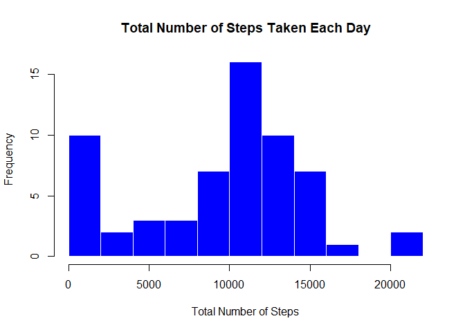
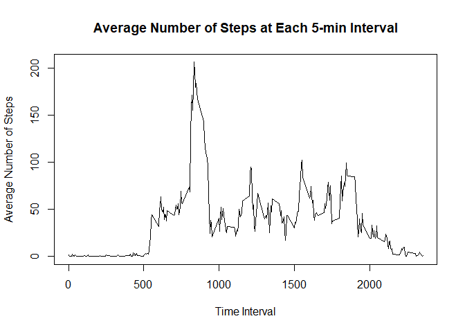
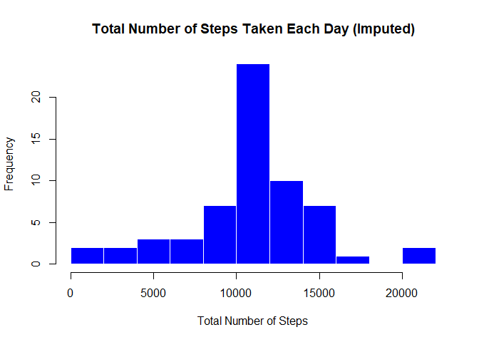

### By: rahima23jsd

## Loading and preprocessing the data

Here we are going to load the data and process / transform the data.


```r
stepdata <- read.csv("activity.csv")
```

## What is mean total number of steps taken per day?

For this part of the assignment, ignore the missing values in the dataset.

Make a histogram of the total number of steps taken each day


```r
sumsteps <- with(stepdata,tapply(steps,date,sum,na.rm=T))

hist(sumsteps,
     main="Total Number of Steps Taken Each Day",
     xlab="Total Number of Steps",
     ylab="Frequency",
     border="white",
     col="blue",
     breaks=10)
```

<!-- -->

Calculate and report the mean and median total number of steps taken per day


```r
meansteps <- mean(sumsteps)
print(meansteps)
```

```
## [1] 9354.23
```

```r
mediansteps <- median(sumsteps)
print(mediansteps)
```

```
## [1] 10395
```

## What is the average daily activity pattern?

Make a time series plot (i.e. type = "l") of the 5-minute interval (x-axis) and the average number of steps taken, averaged across all days (y-axis)


```r
meanint <- with(stepdata,tapply(steps,interval,mean,na.rm=T))
interval <- unique(stepdata$interval)

plot(interval,meanint,type = "l",
     main="Average Number of Steps at Each 5-min Interval",
     xlab="Time Interval",
     ylab="Average Number of Steps")
```

<!-- -->

Which 5-minute interval, on average across all the days in the dataset, contains the maximum number of steps?


```r
maxint <- which.max(meanint)
interval[maxint]
```

```
## [1] 835
```

## Imputing missing values

Note that there are a number of days/intervals where there are missing values (coded as NA). The presence of missing days may introduce bias into some calculations or summaries of the data.

Calculate and report the total number of missing values in the dataset (i.e. the total number of rows with NAs)


```r
sum(is.na(stepdata$steps))
```

```
## [1] 2304
```

Devise a strategy for filling in all of the missing values in the dataset. The strategy does not need to be sophisticated. For example, you could use the mean/median for that day, or the mean for that 5-minute interval, etc.

The strategy I selected is to use the mean for that 5-minute interval.

Create a new dataset that is equal to the original dataset but with the missing data filled in.


```r
fillstepdata <- stepdata

for (i in 1:length(fillstepdata$steps)){
        if (is.na(fillstepdata$steps[i] == TRUE)){        
        fillstepdata$steps[i] <- meanint[match(fillstepdata$interval[i], interval)]  
        } 
}
```

Make a histogram of the total number of steps taken each day and Calculate and report the mean and median total number of steps taken per day. 


```r
sumstepsfill <- with(fillstepdata,tapply(steps,date,sum,na.rm=T))

hist(sumstepsfill,
     main="Total Number of Steps Taken Each Day (Imputed)",
     xlab="Total Number of Steps",
     ylab="Frequency",
     border="white",
     col="blue",
     breaks=10)
```

<!-- -->

```r
meanstepsfill <- mean(sumstepsfill)
print(meanstepsfill)
```

```
## [1] 10766.19
```

```r
medianstepsfill <- median(sumstepsfill)
print(medianstepsfill)
```

```
## [1] 10766.19
```

Q: Do these values differ from the estimates from the first part of the assignment? 

A: Yes, these values differ from the estimates from the first part of the assignment.

Q: What is the impact of imputing missing data on the estimates of the total daily number of steps?

A: Imputing missing data results in a data set where the mean equals the median i.e. it is more symmetrically distributed about the mean.

## Are there differences in activity patterns between weekdays and weekends?

Use the dataset with the filled-in missing values for this part.

Create a new factor variable in the dataset with two levels -- "weekday" and "weekend" indicating whether a given date is a weekday or weekend day.


```r
fillstepdata$weekend = chron::is.weekend(fillstepdata$date)
fillstepdata$daytype[fillstepdata$weekend == 1] <- "weekend"
fillstepdata$daytype[fillstepdata$weekend == 0] <- "weekday"
```

Make a panel plot containing a time series plot (i.e. type = "l") of the 5-minute interval (x-axis) and the average number of steps taken, averaged across all weekday days or weekend days (y-axis).


```r
weekendsteps <- subset(fillstepdata,daytype == "weekend")
weekdaysteps <- subset(fillstepdata,daytype == "weekday")

weekendmeanint <- with(weekendsteps,tapply(steps,interval,mean,na.rm=T))
weekdaymeanint <- with(weekdaysteps,tapply(steps,interval,mean,na.rm=T))

DF2=data.frame(matrix(ncol=0,nrow=length(interval)))
DF2$interval <- interval
DF2$weekday <- weekdaymeanint
DF2$weekend <- weekendmeanint

library(reshape)
DF2 <- melt(DF2, id = "interval")

library(lattice)
xyplot(value ~ interval | variable, data = DF2, type = "l", xlab = "Interval", 
    ylab = "Number of steps", layout = c(1, 2))
```

<!-- -->
